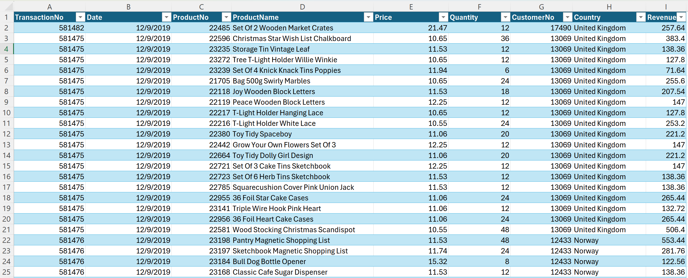
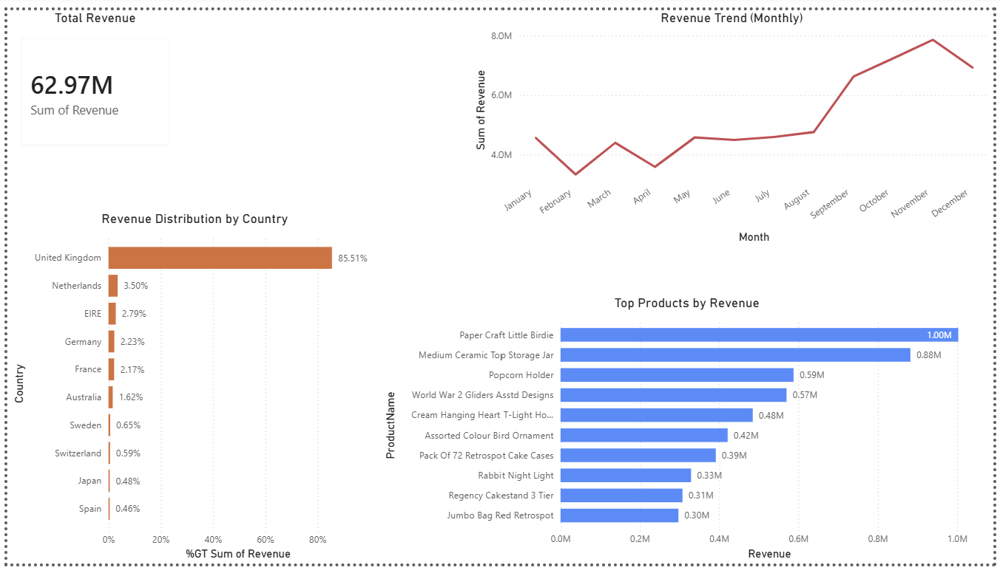
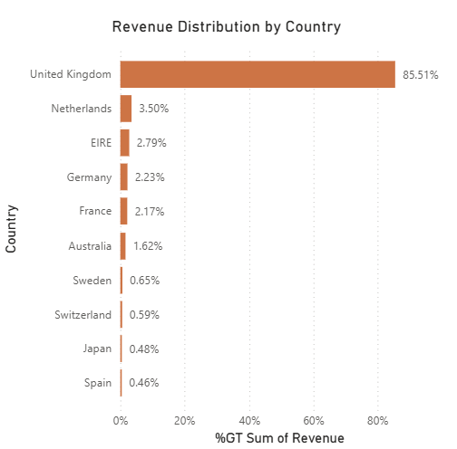
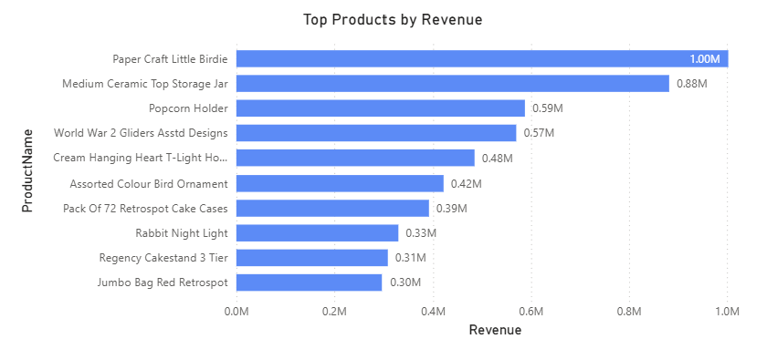

# E-Commerce Sales Performance Analysis Dashboard 

## Overview

This project presents a comprehensive analysis of transactional e-commerce sales data to evaluate overall business performance, identify key revenue drivers, and assess geographic and product-level contributions.

The objective of this analysis is to move beyond surface-level reporting and provide actionable insights that support data-driven decision-making. Specifically, the project addresses the following key business questions:

- Which products contribute most significantly to total revenue?
- How does revenue evolve over time, and are there identifiable seasonal trends?
- How is revenue distributed geographically, and where are potential growth opportunities?

The dashboard is designed to support both high-level strategic evaluation and deeper exploratory analysis, enabling stakeholders to quickly identify performance patterns and areas for optimization.

## Analytical Approach

The dataset consists of granular transaction-level records, which were transformed and aggregated to support meaningful analysis across multiple dimensions.

Data preparation was conducted using Power Query, where missing values, inconsistencies, and formatting issues were addressed. Data types were standardized to ensure accurate aggregation and calculation within Power BI.

The analysis was structured around three primary dimensions:

- **Temporal Analysis**: Evaluating revenue trends over time to identify growth patterns and seasonal fluctuations  
- **Product-Level Analysis**: Identifying high-performing products and understanding revenue concentration  
- **Geographic Analysis**: Examining revenue distribution across countries to assess market dependence and expansion opportunities  

Aggregations were applied to transform raw transactional data into meaningful metrics, such as total revenue, monthly revenue trends, and percentage contribution by country.

Each visualization was intentionally selected to align with a specific analytical objective, ensuring clarity, interpretability, and analytical value.

## Data Source

The dataset used in this project is a publicly available e-commerce transaction dataset sourced from Kaggle. It contains historical sales records including product-level transaction details, customer identifiers, and geographic information.

## Data Preview



This preview displays a sample of the cleaned transactional dataset used in the analysis. The dataset has been structured to include only relevant variables such as transaction details, pricing, quantity, customer identifiers, geographic information, and calculated revenue.

The cleaned structure ensures consistency, improves analytical efficiency, and supports accurate aggregation within the dashboard.

## Tools and Technologies

- Power BI (data visualization and dashboard development)  
- SQL (data querying and analysis)  
- Excel / CSV (data preprocessing)  
- GitHub (version control and project presentation)  

## Dashboard Overview



The dashboard provides a consolidated view of business performance through a combination of KPI indicators and analytical visuals.

The total revenue metric offers a quick assessment of overall performance, while the monthly revenue trend highlights temporal patterns, including growth trajectories and seasonal peaks.

Supporting visuals enable users to analyze performance across product categories and geographic regions. The dashboard is designed as an interactive analytical tool, allowing users to explore relationships between key variables and uncover deeper insights.

## Revenue Distribution by Country



This visualization reveals a highly concentrated revenue distribution, with the United Kingdom accounting for the majority of total sales.

Such concentration introduces significant business risk, as performance is heavily dependent on a single geographic market. Any disruption in this region could have a disproportionate impact on overall revenue.

The limited contribution from other countries suggests untapped market potential, highlighting an opportunity for geographic expansion to improve revenue diversification and long-term stability.

## Top Products by Revenue



This chart highlights the top-performing products based on total revenue, revealing a strong concentration of sales among a relatively small subset of items.

This pattern indicates that a limited number of products are driving a large portion of overall revenue, emphasizing the importance of identifying, promoting, and maintaining these high-performing products.

Additionally, this insight can inform inventory management, pricing strategies, and targeted marketing efforts to maximize revenue generation.

## Key Insights

- **Geographic Concentration**  
  The United Kingdom accounts for approximately 85% of total revenue, indicating a heavy reliance on a single market.

- **Seasonal Trend**  
  Revenue increases steadily throughout the year, with a noticeable peak in November, suggesting strong seasonal demand likely associated with holiday shopping behavior.

- **Product Contribution**  
  Revenue is not evenly distributed across products. A small number of high-performing products generate a significant portion of total revenue.

- **Data Quality Improvement**  
  Data preprocessing and cleaning significantly improved consistency and reliability, ensuring that insights are based on accurate and structured information.

## Business Implications

- Heavy reliance on a single geographic market introduces risk and highlights the need for expansion into secondary regions.  
- Focusing on top-performing products can improve profitability and guide strategic inventory decisions.  
- Seasonal demand patterns should inform marketing strategies, staffing decisions, and inventory planning.  
- Expanding presence in underrepresented markets can improve revenue distribution and reduce dependency on a single region.  

## Visualizations

- **Total Revenue (KPI Card)**  
  Provides an overview of total business performance  

- **Monthly Revenue Trend**  
  Displays how revenue evolves over time, highlighting trends and seasonality  

- **Revenue Distribution by Country (%)**  
  Shows the proportional contribution of each country to total revenue  

- **Top Products by Revenue**  
  Identifies the highest-performing products driving business results  

## Project Structure

```plaintext
business-sales-analysis/
│
├── data/
│   ├── raw/
│   │   └── raw_data.csv
│   │
│   └── processed/
│       ├── cleaned_data.xlsx
│       ├── cleaned_data.csv
│       ├── cleaned_data_sample.xlsx
│       └── cleaned_data_sample.csv
│
├── sql/
│   └── sales_analysis.sql
│
├── dashboard/
│   └── sales_dashboard.pbix
│
├── images/
│   ├── dashboard_overview.png
│   ├── data_preview.png
│   ├── product_analysis.png
│   └── country_analysis.png
│
├── docs/
│   └── project_summary.md
│
└── README.md
```

## Data Accessibility

The dataset used in this project includes detailed transactional records and may be large in size, which can limit direct preview functionality within GitHub.

To improve accessibility, smaller sample dataset files are included:

- cleaned_data_sample.csv  
- cleaned_data_sample.xlsx  

These files provide a representative subset of the cleaned dataset and allow quick preview of the data structure directly within GitHub.

The full dataset remains available for complete analysis, while the sample files improve usability for quick review and evaluation.

## How to View the Dashboard

1. Navigate to the `dashboard` folder in this repository  
2. Download the `.pbix` file  
3. Open it using Power BI Desktop  
4. Interact with the dashboard  

## Author

Daisy Sharma
